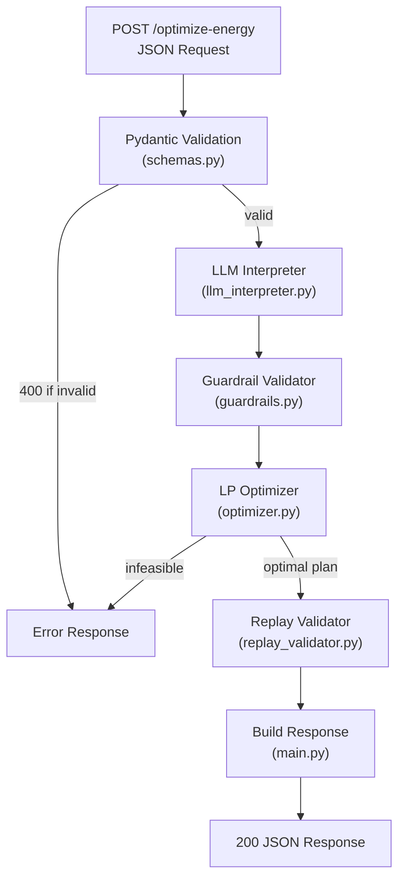

# GridWise Energy Optimizer — Implementation Guide

## Project Structure & Data Flow

```
BongerSingara/
├── app/
│   ├── __init__.py              # Package marker
│   ├── config.py                # Env-var configuration
│   ├── schemas.py               # Pydantic request/response models
│   ├── llm_interpreter.py       # Gemini LLM → structured directives
│   ├── guardrails.py            # Deterministic validation layer
│   ├── optimizer.py             # PuLP LP solver (cost minimisation)
│   ├── replay_validator.py      # Independent constraint replay
│   └── main.py                  # FastAPI app (endpoints + pipeline)
├── tests/
│   ├── __init__.py
│   └── test_api.py              # Mocked-LLM integration tests
├── .env.example                 # Env-var template (no secrets)
├── .gitignore                   # Keeps secrets & cache out of git
├── Dockerfile                   # Lean production container
├── requirements.txt             # Python dependencies
└── README.md                    # Quickstart, architecture, curl examples
```

---

## How the Pipeline Works (Step by Step)



Every module is independent and testable in isolation. The pipeline flows strictly left-to-right — the LLM never sees optimizer output, and the optimizer never sees raw LLM text.

---

## Module-by-Module Guide

---

### 1. `app/config.py` — Configuration

**What it does**: Loads environment variables via `python-dotenv`.

**Key variables**:
| Variable | Used By | Purpose |
|---|---|---|
| `GEMINI_API_KEY` | `llm_interpreter.py` | Auth for Google Gemini API |
| `LLM_MODEL` | `llm_interpreter.py` | Model name (default: `gemini-2.0-flash`) |
| `PORT` / `HOST` | `main.py` | Server bind address |
| `LLM_MAX_RETRIES` | `llm_interpreter.py` | Retry failed LLM calls |

**Nothing to modify** unless you switch LLM providers.

---

### 2. `app/schemas.py` — Pydantic Models

**What it does**: Defines the exact JSON contract from Problem Statement §07 and §10.

**Critical fields** (must match exactly or the judge fails you):

#### Request (`OptimizeRequest`):

```
scenario_id          string
operator_notes       list[str]       (1-3 items)
hours                list[HourEntry] (exactly 24, hours 0-23)
battery              BatteryConfig
```

#### Response (`OptimizeResponse`):

```
scenario_id                 string    (echo from request)
directive_interpretation    list[DirectiveInterpretation]
hourly_plan                 list[HourlyPlanEntry]         (24 entries)
total_grid_kwh              float
total_cost_bdt              float
peak_grid_kwh               float
plan_summary                string
```

> [!IMPORTANT]
> The `@field_validator("hours")` ensures hours are sorted by `hour` field after validation. This guarantees `hours_data[h]` indexing works correctly in the optimizer.

> [!CAUTION]
> Do NOT rename any field. The judge matches field names byte-for-byte. Use `total_cost_bdt`, not `total_cost` or `totalCostBdt`.

---

### 3. `app/llm_interpreter.py` — LLM Interpretation

**What it does**: Sends operator notes to Gemini and receives structured directive interpretations.

**Architecture decisions**:

1. **System prompt** includes all 6 directive types with explicit examples, including **paraphrase examples** from Problem Statement §11.4. This is critical because hidden test cases will use completely different wording.

2. **`response_mime_type: "application/json"`** forces Gemini to output valid JSON, eliminating most parsing failures.

3. **`temperature: 0.1`** for near-deterministic output — the same note should produce the same directive every time.

4. **Retry logic** (default 2 retries = 3 total attempts) handles transient API errors.

5. **Safe fallback**: If all attempts fail, every note defaults to `no_op`. This loses interpretation points but keeps the service running — a crash would lose **all** points for the scenario.

**Where to focus effort**:

> [!TIP]
> The system prompt is the single highest-leverage piece of code in this project. The 25-point "LLM Directive Interpretation" category depends entirely on how well the prompt handles:
>
> - **Factor semantics**: "80% reduction" → `factor = 0.2` (remaining fraction, not the reduction)
> - **Hour conventions**: "1 PM to 3 PM" → `[13, 14]` (start inclusive, end exclusive)
> - **Paraphrase robustness**: "one-fifth of normal solar" = "drops to 20%" = "80% reduction"
> - **Distractor detection**: "cafeteria menu changes" → `no_op`

---

### 4. `app/guardrails.py` — Deterministic Validation

**What it does**: Validates every field of the LLM's structured output against the rules in Problem Statement §08.

**Checks enforced**:

| Check                         | Rule                                                      | On Failure         |
| ----------------------------- | --------------------------------------------------------- | ------------------ |
| `directive_type`              | Must be one of 6 valid types                              | → `no_op`          |
| `hours`                       | Non-empty list of unique ints 0-23, ascending             | → `no_op`          |
| `factor` (solar_reduction)    | Must be float ∈ [0, 1]                                    | → `no_op`          |
| `minimum_energy_kwh`          | Must be ≥ 0 and ≤ `battery.capacity_kwh`                  | → `no_op`          |
| `max_grid_kwh`                | Must be finite and ≥ 0                                    | → `no_op`          |
| `applies` semantics           | `no_op` ↔ `applies=false`; all others ↔ `applies=true`    | Forced correct     |
| `structured_adjustment` shape | Must contain only the keys required by the directive type | Cleaned            |
| Missing note index            | Every note must have exactly one interpretation           | → `no_op` fallback |

**Design principle**: Invalid LLM output is **demoted to `no_op`**, never silently invented. This matches Problem Statement §08: _"The service must not silently invent a new directive type or crash."_

> [!NOTE]
> The `_find_by_index()` helper has a fallback: if the LLM returns entries without correct `note_index` fields, it uses positional indexing. This handles a common LLM failure mode.

---

### 5. `app/optimizer.py` — LP Solver (The Core Math)

**What it does**: Formulates a **Linear Program** (LP) and solves it with PuLP's bundled CBC solver to find the minimum-cost 24-hour schedule.

#### LP Formulation

**Decision Variables** (per hour `h = 0..23`):
| Variable | Bounds | Meaning |
|---|---|---|
| `grid[h]` | `[0, max_grid_cap]` | Grid electricity purchased |
| `solar_used[h]` | `[0, effective_solar[h]]` | Solar energy used |
| `charge[h]` | `[0, max_charge_rate]` or `[0, 0]` if no-charge-window | Battery charge amount |
| `discharge[h]` | `[0, max_discharge_rate]` or `[0, 0]` if no-discharge-window | Battery discharge amount |
| `energy[h]` | `[effective_min, capacity]` | Battery energy after hour h |

**Objective**:
$$\min \sum_{h=0}^{23} \text{grid}[h] \times \text{tariff}[h]$$

**Constraints**:

1. **Energy balance** (each hour):
   $$\text{grid}[h] + \text{solar}[h] + \text{discharge}[h] = \text{demand}[h] + \text{charge}[h]$$

2. **Battery transition** (each hour):
   $$E[h] = E[h-1] + \text{charge}[h] - \text{discharge}[h]$$

3. **End-of-day neutrality**:
   $$E[23] = E_{\text{initial}}$$

#### How Directives Modify the LP

| Directive                 | LP Effect                                                                          |
| ------------------------- | ---------------------------------------------------------------------------------- |
| `solar_reduction`         | `effective_solar[h] = solar_kwh[h] × factor` → reduces `solar_used[h]` upper bound |
| `no_charge_window`        | `charge[h].upBound = 0` for affected hours                                         |
| `no_discharge_window`     | `discharge[h].upBound = 0` for affected hours                                      |
| `minimum_battery_reserve` | `energy[h].lowBound = max(base_min, directive_min)` for affected hours             |
| `max_grid_window`         | `grid[h].upBound = max_grid_kwh` for affected hours                                |

> [!IMPORTANT]
> **Why LP, not MILP?** Charge/discharge mutual exclusivity doesn't need binary variables. In a cost-minimising LP, the solver never simultaneously charges and discharges because it would waste money (you'd buy grid electricity just to store and release it in the same hour). A post-processing step handles any floating-point residual.

> [!TIP]
> The CBC solver finds the **global mathematical optimum** in <5ms for this problem size. This means you get a `quality_ratio = 1.0` on the Optimization Quality metric (10 points) — as long as the directives and constraints are correctly applied.

---

### 6. `app/replay_validator.py` — Independent Verification

**What it does**: Re-simulates the schedule hour-by-hour exactly as the judge would, checking every constraint independently of the optimizer.

**Why this exists**: The judge's evaluation code independently replays your schedule. If there's any bug in the optimizer's post-processing or rounding, the replay validator catches it **before** submission.

**Checks performed** (mirrors Problem Statement §11.3):

- ✅ Non-negative energy values
- ✅ Solar usage ≤ effective solar
- ✅ Energy balance equation (within 0.01 tolerance)
- ✅ Battery state transitions
- ✅ Battery capacity bounds
- ✅ Charge/discharge rate limits
- ✅ no_charge_window / no_discharge_window compliance
- ✅ max_grid_window compliance
- ✅ minimum_battery_reserve compliance
- ✅ idle → battery_kwh = 0
- ✅ End-of-day neutrality

**Totals recalculation**: The response's `total_grid_kwh`, `total_cost_bdt`, and `peak_grid_kwh` come from this module (not the optimizer), ensuring they match what the judge recomputes.

---

### 7. `app/main.py` — FastAPI Application

**What it does**: Wires the complete pipeline and exposes the two required endpoints.

**Endpoints**:
| Endpoint | Method | Response |
|---|---|---|
| `/health` | GET | `{"status": "ok"}` (HTTP 200) |
| `/optimize-energy` | POST | Full `OptimizeResponse` (HTTP 200) |

**Error handling**:
| Situation | HTTP Code | Behaviour |
|---|---|---|
| Malformed JSON / missing fields | **400** | Pydantic `RequestValidationError` → custom handler |
| LP infeasible | **500** | `RuntimeError` caught → controlled JSON error |
| Any unexpected crash | **500** | Generic handler → no stack traces in response |

> [!NOTE]
> `optimize_energy` is defined as `def` (not `async def`). This tells FastAPI to run it in a thread pool, so the synchronous LLM call and LP solve don't block the event loop. The `health` endpoint uses `async def` since it's instant.

---

## Scoring Alignment

| Category (Points)              | How This Implementation Scores                                                 |
| ------------------------------ | ------------------------------------------------------------------------------ |
| **LLM Interpretation (25)**    | Gemini Flash with engineered prompt covering all 6 types + paraphrase examples |
| **Directive Application (25)** | LP constraints directly encode every directive; replay validator confirms      |
| **Optimization Quality (10)**  | CBC solver finds global optimum → `quality_ratio ≈ 1.0`                        |
| **API Contract (10)**          | Pydantic models match schema byte-for-byte; 400/500 handlers correct           |
| **Performance (10)**           | Pipeline ~1-2s total (LLM ~500ms + LP <10ms) → well under 5s p95               |
| **Deployment/Docker (10)**     | Dockerfile with HEALTHCHECK; single `docker run` command                       |
| **Documentation (10)**         | README has quickstart, architecture, curl, tests, known limitations            |

---

## Execution Roadmap (4-Hour Plan)

### Hour 1: Setup & Verify Optimizer (No LLM Needed)

```bash
python3 -m venv venv && source venv/bin/activate
pip install -r requirements.txt
pytest tests/ -v   # All mocked-LLM tests should pass
```

- Verify the LP solver works with mocked directives
- Fix any import or dependency issues

### Hour 2: LLM Integration & Testing

- Set your `GEMINI_API_KEY` in `.env`
- Start the server: `uvicorn app.main:app --port 8000`
- Test with the sample curl from README.md
- Verify interpretations match expected outputs
- Tune the system prompt if needed

### Hour 3: Deploy & Docker

- Build & test Docker image locally
- Deploy to cloud (Render / Railway / Fly.io / Poridhi)
- Verify from external network: `curl https://your-url.com/health`
- Push Docker image to Docker Hub / GHCR

### Hour 4: Polish & Submit

- Run public sample cases against live endpoint
- Record 3-minute architecture video
- Make repository public after deadline
- Submit: endpoint URL, repo link, Docker image tag, video link

---

## Critical Rules Checklist

- [ ] `factor` = remaining fraction (0.2 for 80% reduction), NOT the reduction amount
- [ ] Hours use start-inclusive, end-exclusive convention
- [ ] `applies = false` ONLY for `no_op`; all other directives use `applies = true`
- [ ] `battery_kwh = 0` when `battery_action = "idle"`
- [ ] End-of-day battery energy = initial battery energy (neutrality)
- [ ] `total_grid_kwh`, `total_cost_bdt`, `peak_grid_kwh` are computed from `hourly_plan`, not separate calculations
- [ ] No API keys in git, logs, or responses
- [ ] Service handles malformed JSON without crashing (returns 400)
- [ ] Service handles LLM failures without crashing (falls back to no_op)
